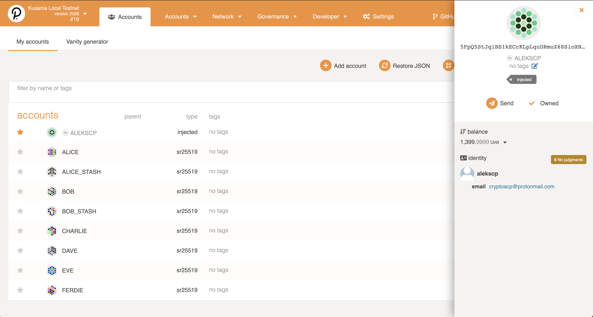

# Hackathon: Hello World! by Polkadot
## [INTERMEDIATE CHALLENGE] FRAME Identity: Set an identity on a local --dev chain

https://gitcoin.co/issue/Polkadot-Network/hello-world-by-polkadot/10/100023936

